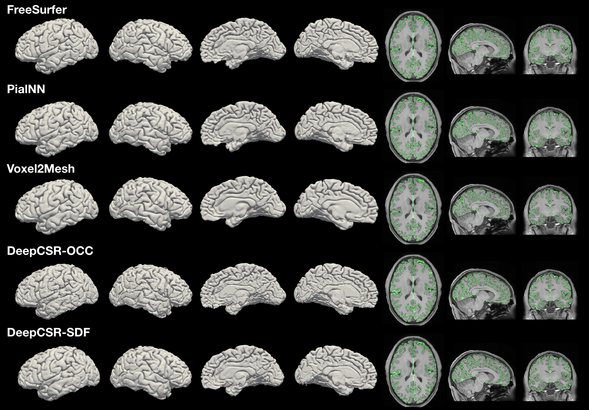
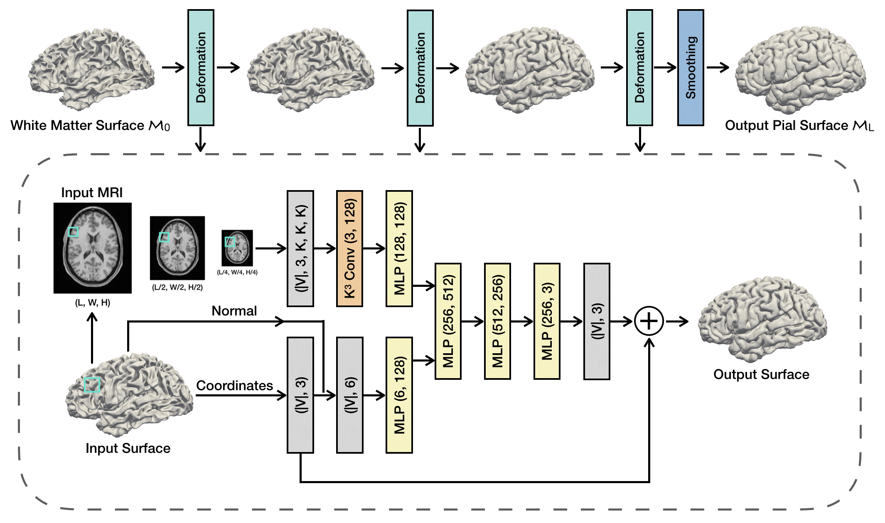

# PialNN: A Fast Deep Learning Framework for Cortical Pial Surface Reconstruction

<!--  -->
<p style="text-align:center;"></p>

This repository contains the PyTorch implementation of the paper:

**PialNN: A Fast Deep Learning Framework for Cortical Pial Surface Reconstruction** [[Paper]](https://arxiv.org/abs/2109.03693)

Qiang Ma, Emma C. Robinson, Bernhard Kainz, Daniel Rueckert, Amir Alansary

The 4th Workshop on Machine Learning in Clinical Neuroimaging ([MLCN2021](https://mlcnws.com/))

---

Pial Neural Network (PialNN) is a 3D deep learning framework for pial surface reconstruction. It is trained end-to-end to deform a given initial white matter surface to a target pial surface by a sequence of learned deformation blocks. PialNN is fast and memory-efficient, which allows reconstructing a pial surface mesh with **150k** vertices within **1s** runtime.


<p style="text-align:center;"></p>

<!--  -->


## Get Started

### Dependencies

The following packages are required for running PialNN:
- Python >= 3.6
- [PyTorch](https://pytorch.org/) >= 1.5.0
- [PyTorch3D](https://github.com/facebookresearch/pytorch3d/blob/main/INSTALL.md) = 0.4.0
- [PyTorch Geometric (PyG)](https://pytorch-geometric.readthedocs.io/en/latest/notes/installation.html)
- [Trimesh](https://trimsh.org/install.html)
- [NiBabel](https://nipy.org/nibabel/installation.html)
- SciPy, NumPy


### Dataset
The following files are required for training and testing. The data should be generated by [FreeSurfer](https://surfer.nmr.mgh.harvard.edu/) or in the same format.
```
./data/train/SUBJECT_NAME/mri/orig.mgz
./data/train/SUBJECT_NAME/surf/lh.white
./data/train/SUBJECT_NAME/surf/lh.pial
./data/train/SUBJECT_NAME/surf/rh.white
./data/train/SUBJECT_NAME/surf/rh.pial
```
```orig.mgz``` is the brain MRI volume. ```lh.white/rh.white``` are the meshes of initial white matter cortical surfaces of left/right cerebrum hemispheres. ```lh.pial/rh.pial``` are ground truth pial surface meshes. An example data is provided in ```./data/test/example/```.

We use [HCP Young Adult Dataset](https://www.humanconnectome.org/study/hcp-young-adult/data-releases) for training and testing in this paper.


### Running Demos

You can run the following codes to predict a pial surface based on the provided example data.
```
git clone https://github.com/m-qiang/PialNN.git
python eval.py --data_path=./data/test/ --hemisphere=lh --save_mesh_eval=True
```
The output pial surface mesh will be saved in ```./ckpts/eval/``` as .obj format.


## Training

Download your training data to ```./data/train/``` and run
```
python train.py --data_path=./data/train/ --hemisphere=lh
```
For more information about the training configuration, please see
```
python train.py --help
```
The pretrained models of PialNN for both left and right hemispheres are provided:
```
./ckpts/model/pialnn_pretrained_lh.pt
./ckpts/model/pialnn_pretrained_rh.pt
```

## Evaluation
Download your testing data to ```./data/test/``` and run
```
python eval.py --data_path=./data/test/ --hemisphere=lh
```

Three distance-based matrics will be computed: Chamfer Distance (CD), Average Absolute Distance (AD), and Hausdorff Distance (HD).

For the purpose of debugging or validation, the evaluation result of the provided example data in ```./data/test/example/``` should be

- CD=0.39, AD=0.20, HD=0.40


<!-- ## Citation
If you use this code for your research, please consider citing our paper:
```
{@inprocessding}
``` -->